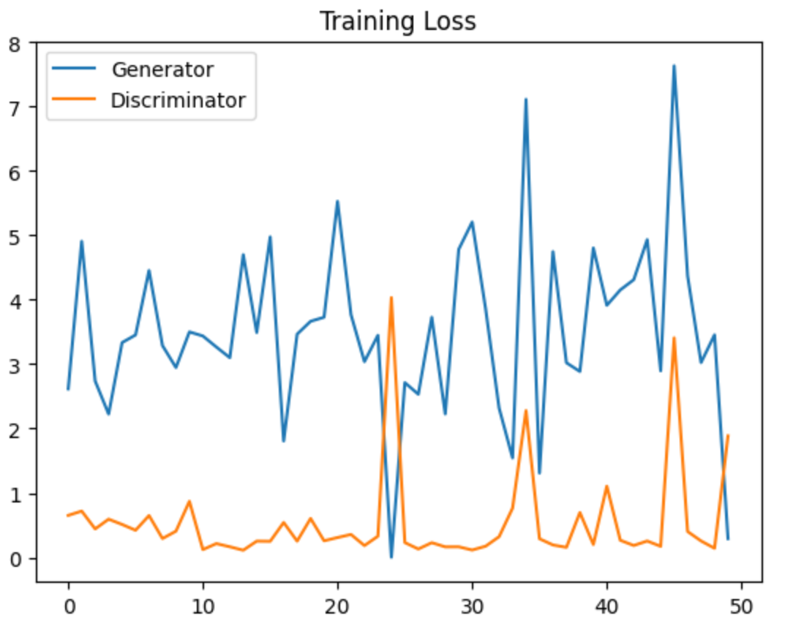
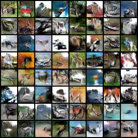
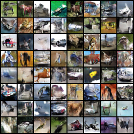
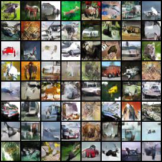

# DCGAN for CIFAR-10 Image Generation

## 1. Project Description

(a) This project implements a Deep Convolutional Generative Adversarial Network (DCGAN) to generate realistic images from the CIFAR-10 dataset 
(b) The dataset contains 50,000 32x32 color images across 10 classes 
(c) The model trains a generator to synthesize images from random noise and a discriminator to distinguish real from fake images using adversarial learning 

## 2. Tech Stack / Tools Used

(a) Python 3.11+ 
(b) PyTorch 
(c) Torchvision 
(d) NumPy 
(e) Matplotlib 

## 3. Objectives / Tasks

(a) Load and preprocess the CIFAR-10 dataset from pickle files 
(b) Define the Generator network to synthesize 32x32x3 images from latent vectors 
(c) Define the Discriminator network to classify images as real or fake 
(d) Implement adversarial training with alternating updates to generator and discriminator 
(e) Visualize generated samples and training loss curves 

## 4. Implementation / Methods

### 4.1 Import Libraries

(a) Imported torch and torchvision for tensor operations and data handling 
(b) Used torch.nn and torch.optim for model definition and optimization 
(c) Imported matplotlib.pyplot for visualization and pathlib.Path for file system operations 
(d) Used pickle and numpy for loading and processing CIFAR-10 pickle batches 

### 4.2 Data Loading and Preprocessing

(a) Defined transform pipeline with ToTensor and normalization to scale pixel values to [-1, 1] 
(b) Implemented loadCifarData to read all data_batch_* files, stack images, and convert to tensors 
(c) Created TensorDataset and DataLoader with batch size 128, shuffling, 4 workers, and memory pinning 
(d) Set device to CUDA if available, otherwise CPU 

### 4.3 Define Generator Model

(a) Generator inherits from nn.Module with z_dim=100 input noise dimension 
(b) Uses sequential transposed convolutions to upsample from 1x1 to 32x32 
(c) Applies BatchNorm2d and ReLU after each transposed conv except the last 
(d) Final layer uses Tanh to output images in [-1, 1] range 
(e) Forward pass reshapes input z to (N, z_dim, 1, 1) before sequential processing 

### 4.4 Define Discriminator Model

(a) Discriminator inherits from nn.Module and processes 32x32x3 input 
(b) Uses sequential convolutions to downsample from 32x32 to 1x1 
(c) Applies LeakyReLU(0.2) after each conv and BatchNorm2d after intermediate layers 
(d) Final convolution outputs single value passed through Sigmoid for probability 
(e) Forward pass returns flattened scalar per image 

### 4.5 Design Training Function

(a) Initialized Generator and Discriminator on selected device 
(b) Used Adam optimizer with learning rate 2e-4 and betas=(0.5, 0.999) for both networks 
(c) Applied BCELoss as adversarial loss function 
(d) Generated fixed noise vector of 64 samples for consistent visualization 
(e) Training loop per epoch: 
    Loaded real batch and scaled to [-1, 1] 
    Trained Discriminator on real (label 1) and fake (label 0) samples 
    Trained Generator to fool Discriminator (target label 1) 
    Recorded final batch losses 
(f) Every 5 epochs: generated and saved sample images, saved generator checkpoint, printed losses 
(g) Returned loss history for plotting 

## 5. Results / Outputs

  

**Epoch 10：**

  

**Epoch 30：**

  

**Epoch 50：**

  

## 6. Conclusion / Insights

(a) The DCGAN successfully learns to generate CIFAR-10-like images through adversarial training 
(b) Generator improves progressively while discriminator maintains pressure 
(c) Batch normalization and LeakyReLU contribute to training stability 
(d) Potential improvements include conditional generation or Wasserstein loss for better convergence 

## 7. Acknowledgements / References

(a) PyTorch Official Documentation: https://pytorch.org/docs/stable/index.html 
(b) CIFAR-10 Dataset: https://www.cs.toronto.edu/~kriz/cifar.html 
(c) Radford, A., Metz, L., & Chintala, S. (2015). Unsupervised Representation Learning with Deep Convolutional Generative Adversarial Networks 

