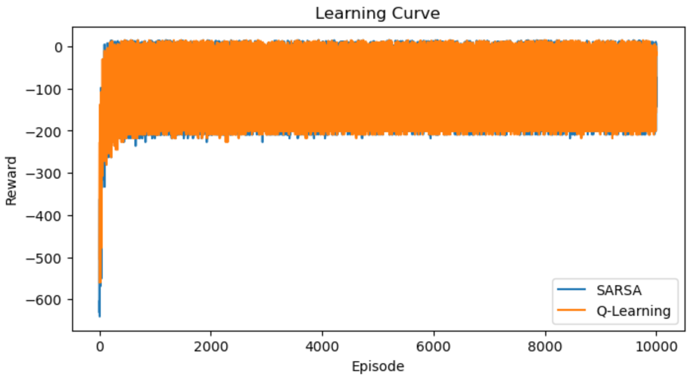

# Reinforcement Learning: Q-Learning and SARSA on Taxi-v3

## 1. Project Description

(a) This project implements and compares two reinforcement learning algorithms — Q-Learning and SARSA, in the Taxi-v3 environment from OpenAI Gym.
(b) It analyzes convergence behavior and exploration efficiency under different strategies including ε-greedy, Softmax, and Upper Confidence Bound (UCB).
(c) The project further explores hyperparameter sensitivity through a grid search of the learning rate (α) and discount factor (γ), visualized with heatmaps.

## 2. Tech Stack / Tools Used

(a) Python 3.10
(b) Gymnasium (Taxi-v3 environment)
(c) NumPy, Pandas for data handling and numerical computation
(d) Matplotlib, Seaborn for visualization

## 3. Objectives / Tasks

### 3.1 Algorithm Implementation

(a) Implement Q-Learning and SARSA algorithms from scratch using tabular methods.
(b) Compare their convergence performance and policy stability.

### 3.2 Exploration Strategy Analysis

(a) Integrate ε-greedy, Softmax, and UCB exploration strategies into the Q-Learning framework.
(b) Assess how different exploration mechanisms influence training efficiency.

### 3.3 Parameter Optimization

(a) Perform grid search over α (learning rate) and γ (discount factor).
 (b) Analyze performance trends with visual heatmaps to identify optimal combinations.

## 4. Implementation / Methods

### 4.1 Environment Setup

(a) Initialize the Taxi-v3 environment with controlled random seeds to ensure reproducibility.
(b) Define environment state and action spaces for agent-environment interaction.

### 4.2 Q-Learning Implementation

(a) Initialize a Q-table with zeros representing state-action values.
(b) Use ε-greedy exploration to balance exploration and exploitation.
(c) Update Q-values using the Bellman optimality equation with maximum next-state value.
(d) Optionally apply ε decay for more stable convergence.

### 4.3 SARSA Implementation

(a) Initialize a Q-table for on-policy learning.
(b) Select actions using ε-greedy and update values based on the next action actually taken.
(c) Compare to Q-Learning to demonstrate the difference between on-policy and off-policy learning.

### 4.4 Extended Exploration Strategies

(a) Implement Softmax exploration to select actions probabilistically based on Q-values.
(b) Implement Upper Confidence Bound (UCB) exploration to balance uncertainty and reward estimates.
(c) Visualize the reward trends of each method over episodes.

### 4.5 Visualization and Evaluation

(a) Apply moving-average smoothing to reward curves for better convergence visualization.
(b) Plot performance curves comparing different learning and exploration strategies.
(c) Generate a heatmap showing the effect of α and γ combinations on average reward.

## 5. Results / Outputs

  

  

## 6. Conclusion / Insights

(a) Q-Learning converges faster but may be less stable under high exploration settings.
(b) SARSA demonstrates safer convergence through on-policy updates.
(c) Softmax and UCB strategies improve exploration efficiency and reduce variance when tuned properly.
(d) Mid-range α and γ values tend to yield optimal learning performance, balancing exploration depth and update stability.

## 7. Acknowledgements / References

(a) OpenAI Gymnasium for the Taxi-v3 environment.
(b) Sutton, R.S. & Barto, A.G. (2018). *Reinforcement Learning: An Introduction (2nd Edition).*

(c) NumPy, Pandas, Matplotlib, and Seaborn official documentation.
