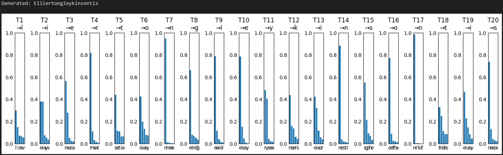
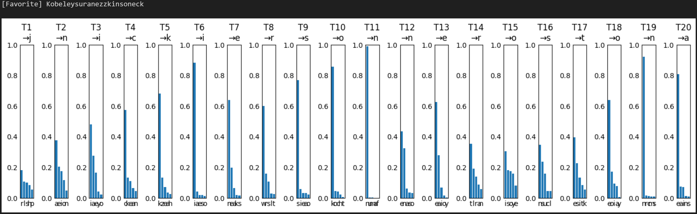

# RNN for Name Generation

## 1. Project Description

(a) This project implements a recurrent neural network (RNN) to generate plausible names based on a dataset of existing names 
(b) The model uses character-level sequences to learn patterns in name structures 
(c) It demonstrates training and sampling techniques for text generation tasks 

## 2. Tech Stack / Tools Used

(a) Python 3.11+ 
(b) PyTorch 
(c) NumPy 
(d) Matplotlib 

## 3. Objectives / Tasks

(a) Load and preprocess name data from text file 
(b) Create character alphabet and encoding mappings 
(c) Define dataset and dataloader for sequence processing 
(d) Build RNN model for character prediction 
(e) Train model on name sequences 
(f) Implement generation functions for new names with optional prefixes and constraints 

## 4. Implementation / Methods

### 4.1 Import Libraries

(a) Imported standard Python modules: os, random, math, itertools, string, time, json 
(b) Imported numpy for array operations 
(c) Imported torch and submodules for neural network implementation 
(d) Imported matplotlib.pyplot for visualization 

### 4.2 Set Hyper Parameters

(a) Defined constants: DATA_PATH for input file, EPOCHS=15, BATCH_SIZE=256, EMB_SIZE=32, HIDDEN_SIZE=128, LR=3e-3 
(b) Set DEVICE to CUDA if available, otherwise CPU 
(c) Set random seeds for reproducibility across random, numpy, and torch 

### 4.3 Load Data

(a) Read raw names into rawNames list from file, cleaned with cleanName to title case 
(b) Extracted unique characters to form alphabet, added SOS '^' and EOS '$' tokens 
(c) Created char2idx and idx2char mappings, set VOCAB_SIZE 

### 4.4 Set Database

(a) Defined NameDataset class inheriting from Dataset 
(b) Implemented encode method to convert names to index sequences with SOS/EOS 
(c) __getitem__ returned input sequence (x) and target sequence (y shifted by 1) as idxSeq 
(d) Defined collate function for padding batches with EOS token using padValue, paddedX, paddedY 
(e) Created trainLoader with shuffling and custom collate 

### 4.5 Construct Model

(a) Defined CharRNN class inheriting from nn.Module with parameters vocabSize, embSize, hiddenSize 
(b) Included Embedding layer (vocabSize to embSize) 
(c) GRU layer (embSize to hiddenSize, batch_first=True) 
(d) Linear layer (hiddenSize to vocabSize) for logits 
(e) Forward pass: embed input, pass through GRU, apply linear to get logits 
(f) Instantiated model on DEVICE, CrossEntropyLoss ignoring EOS, Adam optimizer 

### 4.6 Training

(a) Defined trainEpoch function to compute loss over batches using trainLoader 
(b) Model in train mode, zero grad, forward pass, loss calculation, backward, step 
(c) Accumulated loss in totalLoss weighted by batch size 
(d) Looped over EPOCHS calling trainEpoch and printing average loss 

### 4.7 Construct Generation Function

(a) Defined sampleName for generating names with prefix, maxLen, temp, returnLogprobs 
(b) Encoded prefix into inputIdxs, fed to model, sampled subsequent chars using multinomial 
(c) Collected logprobs in probsLog and prefix if requested 
(d) Defined visualizeGen to plot probability distributions per character 
(e) Defined genWithConstraints to filter samples matching suffix using nTries attempts 
(f) In __main__: demonstrated sampling with demoPrefix, constraint generation, visualization 

## 5. Results / Outputs

  

  

## 6. Conclusion / Insights

(a) The RNN effectively captures character dependencies in names for generation 
(b) Temperature parameter controls diversity in sampling outputs 
(c) Constraint functions enable targeted name creation with prefix/suffix 
(d) Potential extensions include larger datasets or advanced architectures like LSTM 

## 7. Acknowledgements / References

(a) PyTorch Official Documentation: https://pytorch.org/docs/stable/index.html 

(b) Cho, K., et al. (2014). Learning Phrase Representations using RNN Encoder-Decoder for Statistical Machine Translation. *Empirical Methods in Natural Language Processing (EMNLP)*. (Introduced the Gated Recurrent Unit - GRU.) 